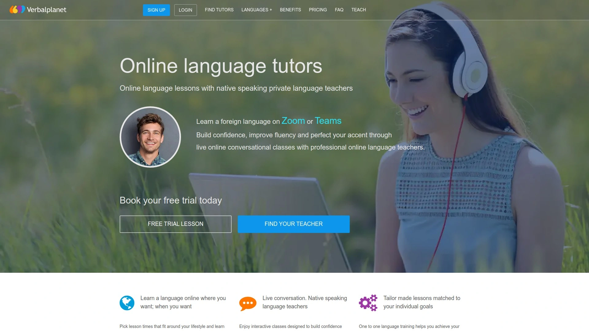

# Top Online Language Learning Platforms in 2025

Finding the right platform to learn a new language has never been easier, with dozens of services offering everything from AI-powered apps to live tutoring with native speakers. Whether you're preparing for travel, advancing your career, or simply exploring a new culture, today's platforms provide flexible, affordable options that fit any schedule.

## **[italki](https://italki.com/)**

A global marketplace connecting learners with teachers in 150+ languages for personalized one-on-one instruction.

italki operates as an online language learning platform headquartered in Hong Kong, connecting over 3 million students with approximately 5,000 teachers across more than 100 countries. The platform distinguishes between professional teachers who provide structured learning plans and community tutors who offer more conversational practice. Students can choose their preferred teacher based on price, availability, teaching style, and language specialization. The platform supports both desktop and mobile learning through cloud-based applications available on iOS and Android. Pricing is set individually by each teacher, typically ranging from $4 to $80 per lesson, with most tutors offering discounted trial sessions. The "instant lesson" feature allows students to connect with available teachers within 5 minutes for spontaneous practice. italki Plus, a subscription service, provides AI-generated study materials based on completed lessons.

## **[Preply](https://preply.com/)**

An intuitive tutoring marketplace offering 90+ languages with integrated video classroom technology.

Preply features its own proprietary video platform called "Preply Space," which functions similarly to Skype but includes built-in tools for sharing vocabulary, documents, and learning materials during lessons. The platform allows students to filter searches by price range, teacher preferences, and availability, with the system automatically matching suitable tutors to student requirements. Lesson pricing starts as low as $1 per hour for some tutors, though rates increase based on teacher qualifications and experience. Unlike italki, Preply requires purchasing lesson packages rather than individual sessions, and offers trial lessons lasting either 25 or 50 minutes depending on student preference. The platform extends beyond language learning to include tutoring in subjects like art, literature, and science.

## **[Verbling](https://verbling.com/)**

A comprehensive platform with over 2,000 verified teachers across 70+ languages, emphasizing teacher quality and platform integration.

Verbling maintains strict teacher verification standards, requiring all tutors to demonstrate prior teaching experience before joining the platform. The service features an all-in-one learning environment where students can schedule lessons, access learning materials, and track progress without switching between different tools. Pricing starts at $6 per hour for English and extends to $18-19 per hour for languages like Japanese and Korean. Every new student receives a free trial lesson to assess teacher compatibility before committing to paid sessions. The platform's interface has been praised for its modern design and ease of use, with over 10,000 qualified tutors available.

## **[Cambly](https://cambly.com/)**

Instant-access English tutoring platform specializing in conversational practice with native speakers.

Cambly focuses exclusively on English language instruction, connecting learners with native English speakers primarily from English-speaking countries. The platform requires no minimum qualifications or teaching experience from its tutors, creating a more casual, conversation-focused learning environment. Students can log in at any time and begin a lesson within minutes without pre-scheduling. Sessions are automatically recorded, allowing students to review previous lessons and identify patterns or mistakes outside of class time. The platform offers specialized tracks for different goals, including TOEFL and IELTS exam preparation, business English, and general conversation skills. Cambly also provides a separate service for children and learners at different proficiency levels.

## **[Tandem](https://tandem.net/)**

Language exchange app with over 1 million users, combining free peer-to-peer practice with optional professional tutoring.

Tandem operates primarily as a language exchange social platform where users connect with native speakers learning their language, creating mutually beneficial learning partnerships. The app includes built-in tools like "Correct" and "Translate" that allow conversation partners to fix mistakes and provide instant translations during chats. Communication options extend beyond text messaging to include voice messages, voice calls, and video calls. The "Goals" feature lets users post personal language objectives and browse others' goals as conversation starters. While the core language exchange functionality is free, Tandem offers a separate professional tutoring service similar to italki and Preply. Profile approval can take up to 7 days, though the company offers expedited approval through paid subscription.

## **[HelloTalk](https://hellotalk.com/)**

Social language learning app with community features including audio rooms, live teaching events, and vocabulary lessons.

HelloTalk combines language exchange with social networking features, allowing users to post life updates and interact through a community "Moments" wall. The platform hosts live audio rooms for passive listening practice or active participation in group conversations. Regular live teaching events with professional instructors are available throughout the day. Built-in lessons cover vocabulary and grammar across multiple languages, supplementing the peer-to-peer exchange model. The interface uses a more playful, emoji-heavy design compared to competitors, which appeals to younger users. All core features are available free, with optional paid upgrades providing additional functionality.

## **[Verbalplanet](https://verbalplanet.com/)**

Independent teacher platform offering 30+ languages where tutors retain 100% of their lesson fees.

Verbalplanet distinguishes itself by allowing teachers to keep their entire lesson revenue without platform fees. Teachers have complete control over their schedules and lesson rates, with no membership fees required to join the platform. The platform offers over 30 foreign languages for instruction. Students and teachers connect directly for scheduling and payment, providing flexibility in lesson structure and duration.

## **[Lingoda](https://lingoda.com/)**

Structured classroom platform following CEFR standards with small group classes and certified native teachers.

Lingoda follows the Common European Framework of Reference (CEFR) levels from A1 to C2, providing internationally recognized curriculum standards. The platform offers both small group classes capped at 5 students and private one-on-one lessons. Subscription plans start at $79.99 monthly for 5 group classes, scaling up to packages with 40 classes per month. All teachers are certified native speakers or C2-level fluent speakers from around the world. Students receive downloadable lesson materials for self-study and review. Classes must be booked in advance, with popular time slots typically filling 5-7 days ahead, and cancellations require at least three days notice.

## **[BaseLang](https://baselang.com/)**

Unlimited Spanish instruction platform with flat-rate pricing and 24/7 access to native Latin American teachers.

BaseLang specializes exclusively in Spanish language instruction, offering unlimited one-on-one classes for $179 per month or a "Lite" option at $99 monthly for up to 30 minutes daily. The platform maintains 350+ experienced native Latin American Spanish teachers available around the clock. Students can book classes with as little as 5 minutes notice and cancel without penalty before the scheduled start time. The curriculum spans 10 levels from absolute beginner (Level 0) to advanced C1-C2 proficiency aligned with DELE standards. New users can try the service for 7 days at $1, with a 35-day money-back guarantee.

## **[Babbel](https://babbel.com/)**

Research-backed language app with 15-minute structured lessons and advanced speech recognition technology.

Babbel claims 92% of users report improvement within 2 months of consistent use. The platform employs the proprietary "Babbel Method" developed by language education experts, emphasizing short, focused lessons that fit into busy schedules. Advanced speech recognition technology provides real-time pronunciation feedback. Cultural content is integrated throughout lessons to provide context beyond vocabulary and grammar. Babbel Live offers scheduled group lessons with professional teachers for subscribers seeking live instruction. Annual pricing for single-language access is approximately $89.40, with multi-language plans available.

## **[Busuu](https://busuu.com/)**

Community-driven platform with 120 million users offering native speaker feedback and CEFR-aligned certification.

Busuu's defining feature is community-based learning where native speakers provide direct feedback on written and spoken exercises. The platform serves 120 million learners across 14 languages. AI-powered study plans adapt to individual learning patterns and goals. Live teacher lessons are available for subscribers seeking professional instruction. The curriculum aligns with CEFR standards and offers official certification upon completing levels. Annual subscription costs $72.99, making it more affordable than comparable platforms. The community feedback system allows learners to submit recordings or written prompts for correction by native speakers.

## **[Wyzant](https://wyzant.com/)**

American tutoring marketplace covering languages and academic subjects with in-person and online options.

Wyzant operates primarily in the United States, connecting students with tutors for one-on-one instruction both online and in-person. Tutors must be US residents with valid social security numbers. The platform covers foreign languages alongside other academic subjects like mathematics, science, and test preparation. Teachers set their own rates and select students based on location and schedule compatibility. Direct deposit payment is available for tutors, with the platform handling transaction processing.

## FAQ

**How do online language tutoring platforms differ from apps like Duolingo?**

Tutoring platforms like italki and Preply connect learners with live teachers for real-time conversation practice and personalized instruction, while apps like Duolingo provide self-paced lessons through gamified exercises. Live tutoring addresses speaking and listening skills more effectively through human interaction, whereas apps excel at vocabulary building and grammar drills. Many learners use both approaches together, combining app-based daily practice with weekly tutoring sessions for comprehensive skill development.

**What should I look for when choosing a language teacher online?**

Key factors include the teacher's native language status, teaching qualifications, student reviews, lesson price, and availability. Most platforms offer trial lessons at discounted rates, allowing you to test teaching style compatibility before committing. Consider whether you prefer structured lessons with professional teachers or conversational practice with community tutors. Your learning goals—exam preparation, business communication, or casual conversation—should guide your teacher selection.

**Are language exchange apps effective for learning?**

Language exchange apps like Tandem and HelloTalk provide valuable free practice with native speakers but work best when combined with structured learning resources. The quality of feedback varies since exchange partners aren't professional teachers. Success depends heavily on finding committed, compatible language partners willing to consistently practice. These platforms excel at developing conversational skills and cultural understanding once you have foundational grammar and vocabulary.

## Conclusion

The language learning landscape offers solutions for every learning style, budget, and schedule. For learners seeking personalized instruction with maximum teacher variety, [italki](https://italki.com/) provides access to thousands of tutors across 150+ languages with flexible pay-per-lesson pricing. Those preferring unlimited practice might consider BaseLang's flat-rate Spanish immersion , while budget-conscious learners can explore free language exchange through Tandem or HelloTalk before investing in paid tutoring. The key to success lies in consistent practice, regardless of which platform you choose.
